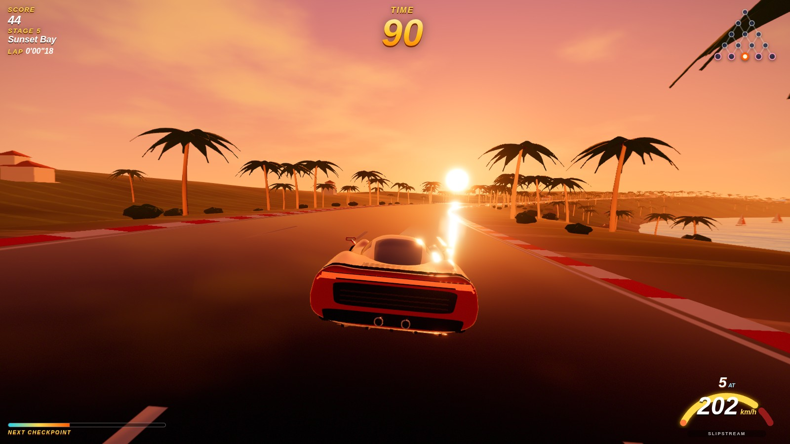
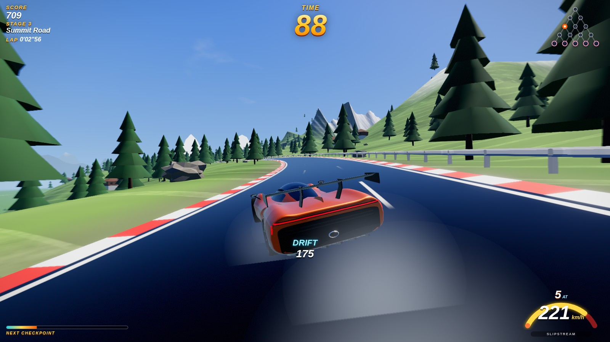
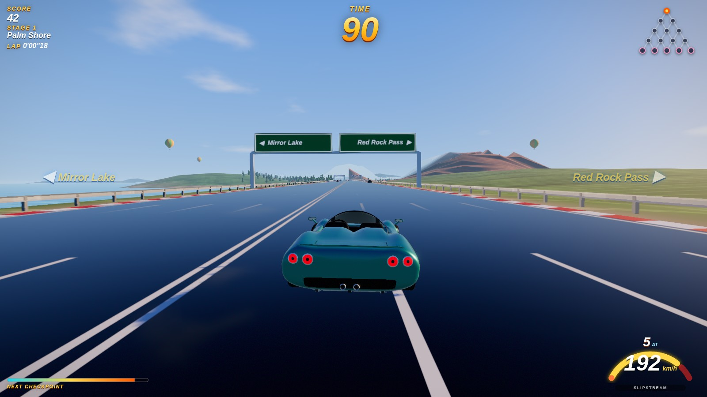
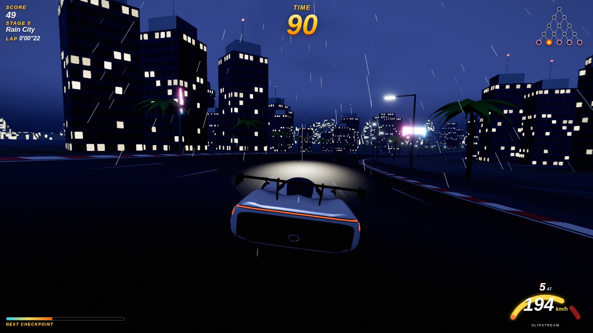

# Coast 2 Coast: an OutRun 2006 fan remake for the web

### ▶ [Play now in your browser](https://themaxaboy.github.io/outrun-2006-remake/)

An arcade racer you play in the browser. It's a tribute to SEGA's **OutRun 2006: Coast 2 Coast**:

- The 15-stage branching pyramid, where you pick left or right at every fork.
- Checkpoint timer with "EXTENDED PLAY".
- Traffic weaving and slipstreams.
- The brake-tap powerslide that made OutRun 2 famous.

Everything is built from scratch for the web and **generated in code**: roads, terrain, scenery, the four original cars, the sky, and the synthesized soundtrack. The build ships with no copyrighted assets.

> This is a non-commercial fan project. It is not affiliated with or endorsed by SEGA. It contains no SEGA or Ferrari assets, music, logos or trademarks. Car designs, stage names and music are original.

## Screenshots

<table>
  <tr>
    <td width="50%"><br><sub><b>Sunset Bay</b>: golden-hour coast road, the Aurora GT-R at 200 km/h.</sub></td>
    <td width="50%"><br><sub><b>Summit Road</b>: a brake-tap powerslide with tyre smoke through a mountain bend.</sub></td>
  </tr>
  <tr>
    <td width="50%"><br><sub><b>The fork</b>: pick left for Mirror Lake or right for Red Rock Pass.</sub></td>
    <td width="50%"><br><sub><b>Rain City</b>: the final stage at night in the rain.</sub></td>
  </tr>
</table>

Screenshots come from the real game, captured headlessly with `npm run screenshots` (build and `npm run preview` first).

## Features

- **15 stages in 5 legs** with a left/right fork at the end of every stage and five goals (A–E). Stages flow into each other with no loading screens. The two branches visibly split at a chevron median, and the next stage's sky, fog and lighting blend in over the first 500 m.
- **Six biomes** across the pyramid: coast, lakeside, canyon, alpine, old-capital temples and a neon metropolis. Time of day and weather vary per stage: morning, noon, golden hour, sunset, dusk, night, rain, snow and mist.
- **OutRun2-style drifting.** Tap the brake while steering, or hold the drift button, to kick the car into a powerslide. Steer into the slide to tighten the line and counter-steer to straighten out. A drift barely costs speed, and chaining drifts builds a score multiplier.
- **Traffic** that changes lanes with indicators, queues behind slow trucks and splits at forks. There are also slipstreams, near-miss bonuses, crash tumbles and spins.
- **Modes:**
  - **OutRun:** beat the clock to a goal.
  - **Time Attack:** empty roads, best times per goal, and a replay **ghost**.
- **Four original cars** (the fourth unlocks when you reach any goal), built procedurally with clearcoat and metal-flake paint. The showroom offers colour, finish (metallic, pearl, matte, solid) and an auto or manual gearbox.
- **Original synthesized radio**, plus an option to **load your own music files**. The engine sound is a real-time AudioWorklet synth driven by RPM and load.
- **Keyboard, gamepad and touch controls.**
- **Local rankings** with initials entry.
- **Built for a steady 60 fps:**
  - Quality presets (Low, Medium, High, Ultra) chosen by GPU auto-detection and a first-run measurement.
  - Dynamic resolution that reacts to missed frames.
  - Streamed 200 m world chunks with pooled GPU buffers and instanced scenery with LODs.
  - Draw-call and triangle budgets checked in CI-style tests.

## Controls

| Action | Keyboard | Gamepad | Touch |
|---|---|---|---|
| Steer | ← → / A D | Left stick / D-pad | Drag the left pad |
| Accelerate | ↑ / W | RT | GAS (auto-gas is on by default) |
| Brake | ↓ / S | LT | BRAKE |
| **Drift** | Tap ↓ while steering, or hold Shift / Space | Tap LT while steering, or hold Ⓐ | Tap BRAKE while steering, or DRIFT |
| Shift down / up (manual) | Q / E | LB / RB | n/a |
| Camera | C | Ⓨ | Pause menu |
| Pause | Esc / P | Start | ❚❚ |

**Drifting tips:**
- Enter a bend above about 70 km/h and tap the brake as you turn in.
- Hold the steering into the bend for a deeper angle and a tighter line.
- Straighten or counter-steer to exit.
- Lifting off the throttle and snapping it back while steering hard also starts a slide.

## Run it

```bash
npm install
npm run dev        # http://localhost:5173
npm run build      # production build in dist/ (relative base, so it can be hosted anywhere)
npm run preview    # serve the build on http://localhost:4173
```

Requires Node 20 or newer and a WebGL2 browser.

### Tests

```bash
npm test           # Vitest unit tests: drift physics, road generation, forks, timer, score, ghosts
npm run e2e        # Playwright: boot, full menu flow, autopilot run through 4 forks to goal C, renderer budgets
npm run bench      # deterministic fly-through per preset → bench/results.json
```

The e2e suite runs headless Chromium on SwiftShader (software WebGL). It checks correctness, leaks and draw-call and triangle budgets, **not** real frame rate.

### Checking 60 fps on real hardware

1. Run `npm run build && npm run preview -- --host`, then open the printed URL.
2. Add `?perf` to show the overlay (FPS, p99 frame time, CPU update time, draw calls, triangles, preset and resolution scale), or turn on **Settings → Show FPS**.
3. Drive a full run. On the auto-selected preset, p99 frame time should stay at or below 16.7 ms. On High, the dynamic-resolution scale in the overlay should stay at 0.8 or above.
4. Open `?bench&preset=high` (or `ultra`) to watch the deterministic autopilot fly-through and compare against `bench/budgets.json`.
5. On a phone on the same network, open the `--host` URL. The auto preset should be Low or Medium, and touch controls appear.

### Measured render budgets (headless proxy)

From `npm run bench`: autopilot fly-through on stages 0-0, 2-1 and 4-1, all passes included.

| Preset | View distance | Max draw calls (budget) | Max triangles (budget) | JS update p95 |
|---|---|---|---|---|
| Low | 820 m | 74 (140) | 113k (450k) | ≤ 3.8 ms |
| Medium | 1100 m | 110 (220) | 326k (900k) | ≤ 3.2 ms |
| High | 1500 m | 132 (300) | 424k (1.6M) | ≤ 3.5 ms |
| Ultra | 2000 m | 154 (420) | 536k (3M) | ≤ 6.6 ms |

Each player car is 10 draw calls and 55–63k triangles, or about 14k on Low.

### Debug URL parameters

| Parameter | Effect |
|---|---|
| `?race` | Skip the menus and start an OutRun race |
| `?autopilot&route=LRLR` | Let the AI drive, taking the given fork choices |
| `?stage=3-2&s=2500` | Start on a given stage (`row-col`) at distance `s` metres |
| `?preset=low\|medium\|high\|ultra` | Force a quality preset |
| `?notraffic`, `?mode=timeattack`, `?car=vento` | Race options |
| `?perf` | Performance overlay |
| `?autotest&ff=8` | Deterministic virtual time: fixed sim steps per frame (used by e2e) |

## How it works

```
src/
  core/      fixed-step loop (120 Hz sim + interpolation), seeded RNG, perf stats, quality presets & dynamic resolution
  track/     15-stage table, pyramid, seeded road "grammar" → sampled course (2 m), fork branches, chunk geometry builders
  world/     biomes, terrain height/colour model, chunk streaming, sky dome, fog/atmosphere, water, backdrops, props, particles
  vehicle/   track-relative arcade sim + drift state machine, collisions, pose; model/ = procedural car builder
  traffic/   lane-following traffic AI + instanced rendering
  camera/    chase / far / bumper cameras + cinematic attract & goal shots
  audio/     WebAudio mixer, AudioWorklet engine, SFX, step-sequenced synth soundtrack, user music
  render/    procedural textures, road/terrain/prop materials, post FX (speed blur, bloom, ACES grade, SMAA)
  game/      Game orchestrator + state machine, timer, score, rankings, ghosts, showroom
  hud/       DOM HUD (no framework, updated only on change)
  ui/        Vue 3 menus
```

- **Track-relative physics.** The car lives in road coordinates: distance along the road `s`, lateral offset `x`, heading relative to the road `ψ`, and drift angle `β`. That makes the handling robust and "arcade-true", and makes collisions trivial. The visual yaw, body roll and pitch are layered on top.
- **Forks.** The last 700 m of a stage widen to 8 lanes. Each child stage starts at the split, offset half the road width to its side, then follows a mirrored S-bend that separates the two roads. When you cross the split, your lateral offset is re-parameterised onto the branch you're on, and a unit test proves the transition is continuous.
- **Rendering.** three.js WebGL2 with pmndrs `postprocessing`. The sky and fog share one atmosphere model so distant terrain melts into the horizon. The sky environment (IBL) is re-baked as stages blend.

## ภาษาไทย (สรุป)

**▶ เล่นได้เลยที่ https://themaxaboy.github.io/outrun-2006-remake/**

เกมแข่งรถบนเว็บที่ทำเป็นบรรณาการให้ **OutRun 2006: Coast 2 Coast** ทุกอย่างสร้างด้วยโค้ดทั้งหมด ได้แก่ ถนน ฉาก รถ 4 คันที่ออกแบบเอง ท้องฟ้า และเพลงสังเคราะห์ ไม่มีไฟล์ลิขสิทธิ์ของ SEGA หรือ Ferrari

- **สเตจ:** ครบ 15 สเตจแบบพีระมิด มีทางแยกซ้าย/ขวาทุกสเตจ เข้าสเตจถัดไปแบบไร้รอยต่อ มี 6 ธีมฉาก พร้อมช่วงเวลาและสภาพอากาศต่างกันในแต่ละสเตจ
- **ดริฟต์สไตล์ OutRun2:** แตะเบรกขณะเลี้ยว หรือกดปุ่ม Drift หักพวงมาลัยเข้าโค้งเพื่อเพิ่มมุม หักสวนเพื่อออกจากดริฟต์ ความเร็วแทบไม่ลด
- **โหมด:** OutRun (แข่งกับเวลา) และ Time Attack (ไม่มีรถอื่น มีรถผีให้แข่งกับสถิติตัวเอง)
- **การควบคุม:** คีย์บอร์ด จอยเกม และจอสัมผัส
- **ประสิทธิภาพ:** เลือกระดับกราฟิกอัตโนมัติ และมี dynamic resolution เพื่อรักษา 60fps
- **วิธีรัน:** `npm install` แล้ว `npm run dev`
- **วิธีเช็ค FPS:** เปิด `?perf` หรือเปิด Settings → Show FPS

## License

Code: MIT. OutRun is a trademark of SEGA. This project only pays homage to it and uses none of SEGA's assets.
